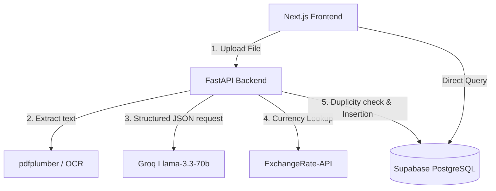

# Ledge AI – Technical Overview & Architecture Document

Welcome to the technical overview of **Ledge AI (Enterprise Ledger)**, an AI-powered financial intelligence platform designed to automate invoice ingestion, data extraction, audit compliance, and expense analytics.

---

## 1. System Architecture

The application is built on a decoupled client-server architecture:
- **Frontend**: Built with **Next.js (App Router)** and React 19, featuring a responsive, custom glassmorphic dashboard styled using pure CSS variables and interactive charts powered by **Chart.js**.
- **Backend**: Powered by **FastAPI** (Python), serving endpoints for file ingestion, PDF parsing, optical character recognition (OCR), LLM-based parsing, currency conversion, and anomaly checking.
- **Database**: **Supabase (PostgreSQL)**, providing robust relational data persistence, sorting, and duplicate lookup.
- **Cognitive Engine**: **Groq API** utilizing the `llama-3.3-70b-versatile` model for advanced extraction.



---

## 2. Environment Variables & Configurations

### Backend Configuration (`backend/.env`)
- `GROQ_API_KEY`: API token for Groq Cloud.
- `SUPABASE_URL`: Endpoint for the Supabase instance.
- `SUPABASE_KEY`: Service role or anon key with write permissions for the `invoices` table.

### Frontend Configuration (`frontend/.env.local`)
- `NEXT_PUBLIC_SUPABASE_URL`: Supabase client-side endpoint.
- `NEXT_PUBLIC_SUPABASE_ANON_KEY`: Supabase public anonymous key.

---

## 3. Database Schema

The core table utilized is `invoices` in **Supabase**. The schema details map directly to the fields extracted by the backend processing pipeline:

| Column Name | Data Type | Description |
|---|---|---|
| `id` | `uuid` (Primary Key) | Auto-generated or unique transaction uuid |
| `file_name` | `text` | The original uploaded file name |
| `vendor` | `text` | Normalized vendor name (lowercase, stripped) |
| `invoice_number` | `text` | Extracted invoice identifier or fallback uuid |
| `date` | `date` | Invoice date in `YYYY-MM-DD` |
| `amount` | `numeric` | Final payable total converted to **INR** |
| `subtotal` | `numeric` | Subtotal amount in **INR** |
| `tax` | `numeric` | Tax amount in **INR** |
| `original_total`| `numeric` | Invoice amount before currency conversion |
| `currency` | `text` | Extracted original currency code (USD, EUR, INR, etc.) |
| `status` | `text` | Transaction status: `Paid` / `Flagged` / `Duplicate` |
| `category` | `text` | Product/Service expense category (e.g., Electronics, SaaS) |
| `product` | `text` | Normalized description of main line item |
| `is_duplicate` | `boolean` | Flag set if invoice is verified as a duplicate |
| `insights`/`findings` | `jsonb` | Array of anomaly structures detected during audit |
| `extra_details` | `jsonb` | Captured optional IDs (GSTIN, reference number, etc.) |
| `created_at` | `timestamp` | Time of upload |

---

## 4. Backend Implementation Details (`backend/main.py`)

### A. Document Parsing Pipeline
When a PDF or image invoice is uploaded via `/upload` or `/process-invoice` endpoints, it undergoes a dual-layer extraction process:
1. **Direct Extract**: The backend tries to parse native text from the document bytes using `pdfplumber`.
2. **OCR Fallback**: If no characters are detected (scanned invoices), the system converts document pages to images using `pdf2image` and reads the text via `pytesseract` (Tesseract OCR).

### B. Cognitive Processing (LLM)
Once text is extracted, a detailed system prompt instructs the `llama-3.3-70b-versatile` model to extract and categorize fields, outputting a strict JSON schema.
- **Robust Identifier Rules**: Instructions prioritize primary invoice identifiers (e.g., Invoice No, Bill No) and fallback to alternative identifiers (Order ID, Receipt No, Challan No) if missing.
- **Regex Fallback**: If the LLM output fails to populate `invoice_number`, a regex-based lookup searches the text for patterns matching common invoice labels.

### C. Financial & Currency Normalization
To ensure consistent metrics across dashboards, the backend normalizes all monetary metrics:
1. **Currency Detection**: Identifies symbols like `₹`, `$`, `€` or text markers like `USD`, `EUR`, `INR`.
2. **Exchange Rates API**: For non-INR currencies, it queries `https://api.exchangerate-api.com/v4/latest/{currency}` to fetch the current conversion rate and transforms `total`, `subtotal`, and `tax` to INR.

### D. Audit & Anomaly Detection Engine
A rules engine computes insights for the invoice:
- **Low Confidence Warning**: Flags the invoice if the LLM confidence score is low (< 0.7).
- **Missing Totals**: Flags invoices where no final payable amount is found.
- **No Tax Warning**: Generates an audit notification if tax is reported as 0.
- **High-Value Invoices**: Flags transactions over ₹50,000 for administrative review.
- **Total Mismatch**: Flags if `subtotal + tax` deviates from `total` by more than ₹5.

### E. Smart Duplicate Checking
Before inserting the invoice, the backend fetches existing invoices from Supabase:
- It normalizes invoice numbers by stripping non-alphanumeric characters (e.g. `INV-2026-001` -> `inv2026001`) and compares them.
- If a match is found, the status is set to `Duplicate` and the `is_duplicate` flag is set to `true`.

---

## 5. Frontend Implementation Details (`frontend/`)

### A. Global State Management (`context/InvoiceContext.js`)
- Shares invoice data using React Context and `useReducer`.
- Orchestrates database CRUD operations: fetches historical items, implements local optimizations when adding items, and executes client-side upserts to Supabase.
- Maps database schema keys to frontend shapes, standardizing fields like `insights` versus `findings` for backwards compatibility.

### B. High-Fidelity Landing Page (`app/page.js`)
- Uses **GSAP** and **ScrollTrigger** to orchestrate scroll-scrub animations.
- Renders pre-rendered background sequence frames (`/frames/frames_xxxx.jpg`) onto an HD-optimized HTML5 Canvas scaled based on the device's pixel ratio.
- Features custom navigation, glowing grids, and testimonial cards.

### C. Analytics Dashboard (`app/dashboard/page.js`)
- Renders KPI metrics dynamically.
- Leverages **Chart.js** to paint:
  - Weekly spending volume (Line Chart with gradient fill).
  - Expense category distribution (Donut Chart).
  - Top vendors by spend (Horizontal Bar Chart).
- Features a conditional warning feed specifically rendering real-time anomalies.

### D. Upload Portal (`app/upload/page.js`)
- Implements a drag-and-drop landing area with file type filters.
- Tracks file statuses asynchronously (`processing`, `completed`, `error`) and updates mock progress bars during backend API transactions.
- Automatically routes the user to the result screen upon completion.

### E. Analysis Results & Audits (`app/result/page.js`)
- Lists extracted values alongside visual warnings.
- Incorporates a **Historical Comparison** bar widget comparing the current invoice total to the vendor's historical average.
- Provides a direct save button to persist/upsert the results into the Supabase database.

### F. Archive & Search (`app/history/page.js`)
- Interactive database query tool with client-side filters (Search by ID or Vendor, filter by status `Paid`, `Pending`, `Flagged`).
- Interactive column sorting (by Date, Amount, and Vendor).
- Displays top vendor summary metrics.

### G. Configuration Panel (`app/settings/page.js`)
- Interactive profile form.
- Push notification toggle selectors (Email alerts, anomaly warnings, weekly reports, Slack).
- Active theme pickers (Dark, Light, System) and accent color palettes.
- Mock API integration keys showing live connection indicators for accounting suites (QuickBooks, Xero, Stripe, Slack).

---

## 6. Step-by-Step Processing Flow

```
[ User Uploads PDF/Image ]
           │
           ▼
[ backend: extract_text_from_pdf ] ──────► (Empty?) ──► [ backend: ocr_pdf (pytesseract) ]
           │                                                       │
           └───────────────────────┬───────────────────────────────┘
                                   │
                                   ▼
                       [ backend: extract_with_llm ] ──► Queries Groq Llama-3.3-70b API
                                   │
                                   ▼
                       [ backend: convert_to_inr ] ────► Exchangerate API (if not INR)
                                   │
                                   ▼
                       [ backend: generate_insights ] ──► Rules Engine (Mismatches, High value, No tax)
                                   │
                                   ▼
                       [ backend: is_duplicate ] ───────► Normalizes ID & checks Supabase database
                                   │
                                   ▼
                       [ backend: Insert DB Record ] ───► Inserts parsed dictionary to Supabase
                                   │
                                   ▼
                       [ frontend: Route to /result ] ──► Renders data, warnings & comparison metrics
```

1. **Upload**: User drops an invoice into the drag-and-drop upload zone on the frontend, initiating a `POST` request to `/process-invoice`.
2. **Text Ingestion**: FastAPI reads the file stream. It extracts characters with `pdfplumber`, or performs image-to-text OCR as a fallback.
3. **Structured Extraction**: The extracted text is sent to the Groq LLM endpoint. It responds with parsed JSON.
4. **Calculations & Normalization**: The backend verifies field properties, converts currency values to INR using ExchangeRate-API rates, and sets the transaction category.
5. **Security & Validation Checks**: The transaction checks for duplicates by scanning existing invoices. It compiles audit warnings into the `insights` list.
6. **Persistence**: The validated, unified dataset is stored in the Supabase PostgreSQL database.
7. **Visualization**: The API returns the record structure, and the frontend updates state, redirects the view to `/result` to display data, warnings, and comparison bars, and renders the visual statistics inside the Dashboard and Analytics pages.
